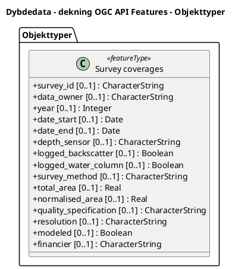

# Produktspesifikasjon: Dybdedata - dekning OGC API Features

## Innledning, historikk og endringslogg

### Innledning

### Historikk

### Endringslogg

### Normative referanser

## Definisjoner og forkortelser

### Definisjoner

### Forkortelser

## Generelt om spesifikasjonen

### Unik identifisering

58a262c2-4903-4dea-9490-10065fda6756

#### Fullstendig navn

Dybdedata - dekning OGC API Features

#### Versjon

2025-02-14

### Referansedato

2025-02-14

### Ansvarlig organisasjon

Kartverket

### Språk

### Hovedtema

MAREANO, batymetri, dybdedata, DTM, sjømåling, ekkolodd, Nordsjøen, Barentshavet, Havområde, Hav, Norge, Svalbard, Høyde, Høydedata

### Temakategori

### Sammendrag

Tjenesten viser en oversikt over hvilke norske sjøområder som har blitt dybdekartlagt/sjømålt. Dybdedata er samlet inn over en lang tidsperiode, av ulike aktører og med ulikt utstyr. I egenskapstabellen til datasettet finnes det opplysninger som måleårstall, kartleggingsmetode, dataeier/hvilken aktør som har samlet inn dataene, utstyr, ekkolodd-type, spesifikasjon og oppløsning. 
Innholdet i tjenesten er basert på tilgjengelig data hos Kartverket.

Denne tjenesten er basert på OGC-API Features. OGC-API er en gruppe nye standarder som blir utviklet av Open Geospatial Consortium (OGC) for lettere å kunne tilgjengeliggjøre geografiske data på web. 
Ikke alle GIS-programvarer har etablert støtte til de nye standarder, som gjør at funksjonaliteten kan oppleves som noe tregt i enkelte klienter, som f.eks. QGIS.

### Formål

Formålet med tjenesten er å gi en oversikt over innsamlede og tilgjengelige dybdedata.

## Spesifikasjonsomfang

- **nivå**: service
- **utstrekning**:
  - **romlig**:
    - **bbox**: -14.0, 56.0, 40.0, 86.0
    - **description**: National
  - **tidsmessig**: - **intervall**: - 2025-02-14, 2025-02-14
- **juridiske begrensninger**:
  - **tilgangsbegrensninger**: Åpne data
  - **bruksbegrensninger**: Lisens
  - **lisens**: No conditions apply to access and use
  - **lisenslenke**: http://inspire.ec.europa.eu/metadata-codelist/ConditionsApplyingToAccessAndUse/noConditionsApply
  - **sikkerhetsbegrensninger**: Ugradert

## Innhold og struktur

- **bruk**:
  Tjenesten kan benyttes til å få en oversikt over tilgjengelige dybdedata, f.eks. i forbindelse med planlagte aktiviteter i et spesifikt område. Ved hjelp av informasjon tilgjengelig i egenskapstabellen, vil man kunne få et innblikk i kvalitet og egnethet av dybdedata. Nyere data er å anse av best kvalitet, da det har hovedsakelig blitt samlet inn ved bruk av multistråle ekkolodd, mens eldre data er samlet inn med enkeltstråle ekkolodd eller annet eldre utstyr.  
  Tjenesten kan også benyttes til kart, presentasjoner, ulike analyser eller som beslutningsgrunnlag.

### Datamodell

#### Survey coverages

Geographical areas delimiting surveys

Geometri:
- itemType: feature
- type: geometry-any
- crs:
  - http://www.opengis.net/def/crs/OGC/1.3/CRS84
  - http://www.opengis.net/def/crs/EPSG/0/4326
  - http://www.opengis.net/def/crs/EPSG/0/4258
  - http://www.opengis.net/def/crs/EPSG/0/25831
  - http://www.opengis.net/def/crs/EPSG/0/25832
  - http://www.opengis.net/def/crs/EPSG/0/25833
  - http://www.opengis.net/def/crs/EPSG/0/25834
  - http://www.opengis.net/def/crs/EPSG/0/25835
  - http://www.opengis.net/def/crs/EPSG/0/25836

Egenskaper

| **Navn:** | **geometry** |
| --- | --- |
| Definisjon: | Elementtype: feature |
| Type: | geometry-any |
| OGC-rolle: | primary-geometry |

| **Navn:** | **survey_id** |
| --- | --- |
| Definisjon: | Unique identification number. |
| Multiplisitet: | 0..1 |
| Type: | string |
| OGC-rolle: | id |

| **Navn:** | **data_owner** |
| --- | --- |
| Definisjon: | Company or institution that owns the data. |
| Multiplisitet: | 0..1 |
| Type: | string |

| **Navn:** | **year** |
| --- | --- |
| Definisjon: | Year the survey ended. |
| Multiplisitet: | 0..1 |
| Type: | integer |

| **Navn:** | **date_start** |
| --- | --- |
| Definisjon: | Date when survey started. |
| Multiplisitet: | 0..1 |
| Type: | date (string) |

| **Navn:** | **date_end** |
| --- | --- |
| Definisjon: | Date when survey ended. |
| Multiplisitet: | 0..1 |
| Type: | date (string) |

| **Navn:** | **depth_sensor** |
| --- | --- |
| Definisjon: | Depth sensor used. |
| Multiplisitet: | 0..1 |
| Type: | string |

| **Navn:** | **logged_backscatter** |
| --- | --- |
| Definisjon: | Backscatter is logged during survey. |
| Multiplisitet: | 0..1 |
| Type: | boolean |

| **Navn:** | **logged_water_column** |
| --- | --- |
| Definisjon: | Water column is logged during survey. |
| Multiplisitet: | 0..1 |
| Type: | boolean |

| **Navn:** | **survey_method** |
| --- | --- |
| Definisjon: | Method for collecting data. |
| Multiplisitet: | 0..1 |
| Type: | string |

| **Navn:** | **total_area** |
| --- | --- |
| Definisjon: | Total area of the survey in km2. |
| Multiplisitet: | 0..1 |
| Type: | number |

| **Navn:** | **normalised_area** |
| --- | --- |
| Definisjon: | Total area normalized to 100 meters depth. |
| Multiplisitet: | 0..1 |
| Type: | number |

| **Navn:** | **quality_specification** |
| --- | --- |
| Definisjon: | Technical specification used during survey. |
| Multiplisitet: | 0..1 |
| Type: | string |

| **Navn:** | **resolution** |
| --- | --- |
| Definisjon: | Resolution of terrain model. |
| Multiplisitet: | 0..1 |
| Type: | string |

| **Navn:** | **modeled** |
| --- | --- |
| Definisjon: | Terrain model created. |
| Multiplisitet: | 0..1 |
| Type: | boolean |

| **Navn:** | **financier** |
| --- | --- |
| Definisjon: | Company or institution financing the survey. |
| Multiplisitet: | 0..1 |
| Type: | string |

## Referansesystem

## Kvalitet

- **nivå**: service

## Datafangst

## Datavedlikehold

Kontinuerlig
Tjenesten kan benyttes til å få en oversikt over tilgjengelige dybdedata, f.eks. i forbindelse med planlagte aktiviteter i et spesifikt område. Ved hjelp av informasjon tilgjengelig i egenskapstabellen, vil man kunne få et innblikk i kvalitet og egnethet av dybdedata. Nyere data er å anse av best kvalitet, da det har hovedsakelig blitt samlet inn ved bruk av multistråle ekkolodd, mens eldre data er samlet inn med enkeltstråle ekkolodd eller annet eldre utstyr.  
Tjenesten kan også benyttes til kart, presentasjoner, ulike analyser eller som beslutningsgrunnlag.

## Presentasjon

## Leveranse

- **distribusjoner**:
  - **format**: - **format**: OGC:API-Features
    - **tilgang**:
      - **lenke**: https://hybasapi.atgcp1-prod.kartverket.cloud/
      - **protokoll**: OGC:API-Features
  - **tittel**: OGC API-Features
    - **format**: - **format**: OGC API-Features
    - **tilgang**:
      - **lenke**: https://hybasapi.atgcp1-prod.kartverket.cloud/
      - **protokoll**: OGC:API-Features

## Metadata

- **standard**: ISO19115
- **standardversjon**: 2003
- **metadatadato**: 2025-02-26
- **språk**: nor
- **kontaktpunkt**:
  - **organisasjon**: Kartverket
  - **epost**: kundesenteret@kartverket.no
  - **rolle**: pointOfContact
- **identifikatorer**:
  - **myndighet**: geonorge
    - **kode**: 58a262c2-4903-4dea-9490-10065fda6756
- **metadatalenke**: https://www.geonorge.no/geonetwork/srv/nor/csw?service=CSW&request=GetRecordById&version=2.0.2&outputSchema=http://www.isotc211.org/2005/gmd&elementSetName=full&id=58a262c2-4903-4dea-9490-10065fda6756
