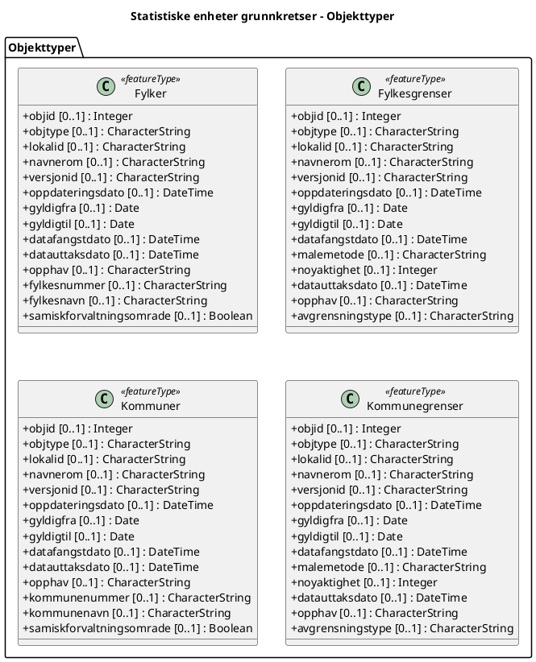

# Produktspesifikasjon: Statistiske enheter grunnkretser

## Innledning, historikk og endringslogg

### Innledning

### Historikk

### Endringslogg

### Normative referanser

## Definisjoner og forkortelser

### Definisjoner

### Forkortelser

## Generelt om spesifikasjonen

### Unik identifisering

51d279f8-e2be-4f5e-9f72-1a53f7535ec1

#### Fullstendig navn

Statistiske enheter grunnkretser

#### Versjon

### Referansedato

2025-02-21

### Ansvarlig organisasjon

Kartverket

### Språk

nor

### Hovedtema

Befolkningsfordeling, Inspire, geodataloven, modellbaserteVegprosjekter, fellesDatakatalog, Norge digitalt, Befolkning, Norge

### Temakategori

Administrative grenser

### Sammendrag

Datasettet viser grunnkretsinndelingen i Norge. Grunnkretser er stabile statistiske enheter som ble opprettet i samarbeid mellom kommunen og Statistisk sentralbyrå (SSB) rundt 1980.

### Formål

## Spesifikasjonsomfang

- **nivå**: dataset
- **utstrekning**: - **tidsmessig**: - **intervall**: - 2025-02-21, 2025-02-21
- **juridiske begrensninger**:
  - **tilgangsbegrensninger**: Åpne data
  - **bruksbegrensninger**: Lisens
  - **lisens**: Creative Commons BY 4.0 (CC BY 4.0)
  - **lisenslenke**: https://creativecommons.org/licenses/by/4.0/
  - **sikkerhetsbegrensninger**: Ugradert

## Innhold og struktur

- **bruk**: Statistiske beregninger. Analyse og presentasjon i et GIS-system. Produksjon av kart og avledede produkter. Forvaltningsmessig saksbehandling av kretser.

### Datamodell

#### Fylker

Fylker 2024

Geometri:
- itemType: feature
- type: geometry-any
- crs:
  - http://www.opengis.net/def/crs/OGC/1.3/CRS84
  - http://www.opengis.net/def/crs/EPSG/0/3857

Egenskaper

| **Navn:** | **geometry** |
| --- | --- |
| Definisjon: | Elementtype: feature |
| Type: | geometry-any |
| OGC-rolle: | primary-geometry |

| **Navn:** | **objid** |
| --- | --- |
| Definisjon: | objid |
| Multiplisitet: | 0..1 |
| Type: | integer |

| **Navn:** | **objtype** |
| --- | --- |
| Definisjon: | objtype |
| Multiplisitet: | 0..1 |
| Type: | string |

| **Navn:** | **lokalid** |
| --- | --- |
| Definisjon: | lokalid |
| Multiplisitet: | 0..1 |
| Type: | string |

| **Navn:** | **navnerom** |
| --- | --- |
| Definisjon: | navnerom |
| Multiplisitet: | 0..1 |
| Type: | string |

| **Navn:** | **versjonid** |
| --- | --- |
| Definisjon: | versjonid |
| Multiplisitet: | 0..1 |
| Type: | string |

| **Navn:** | **oppdateringsdato** |
| --- | --- |
| Definisjon: | oppdateringsdato |
| Multiplisitet: | 0..1 |
| Type: | date-time (string) |

| **Navn:** | **gyldigfra** |
| --- | --- |
| Definisjon: | gyldigfra |
| Multiplisitet: | 0..1 |
| Type: | date (string) |

| **Navn:** | **gyldigtil** |
| --- | --- |
| Definisjon: | gyldigtil |
| Multiplisitet: | 0..1 |
| Type: | date (string) |

| **Navn:** | **datafangstdato** |
| --- | --- |
| Definisjon: | datafangstdato |
| Multiplisitet: | 0..1 |
| Type: | date-time (string) |

| **Navn:** | **datauttaksdato** |
| --- | --- |
| Definisjon: | datauttaksdato |
| Multiplisitet: | 0..1 |
| Type: | date-time (string) |

| **Navn:** | **opphav** |
| --- | --- |
| Definisjon: | opphav |
| Multiplisitet: | 0..1 |
| Type: | string |

| **Navn:** | **fylkesnummer** |
| --- | --- |
| Definisjon: | fylkesnummer |
| Multiplisitet: | 0..1 |
| Type: | string |
| OGC-rolle: | id |

| **Navn:** | **fylkesnavn** |
| --- | --- |
| Definisjon: | fylkesnavn |
| Multiplisitet: | 0..1 |
| Type: | string |

| **Navn:** | **samiskforvaltningsomrade** |
| --- | --- |
| Definisjon: | samiskforvaltningsomrade |
| Multiplisitet: | 0..1 |
| Type: | boolean |

#### Fylkesgrenser

Fylkesgrenser 2024

Geometri:
- itemType: feature
- type: geometry-any
- crs:
  - http://www.opengis.net/def/crs/OGC/1.3/CRS84
  - http://www.opengis.net/def/crs/EPSG/0/3857

Egenskaper

| **Navn:** | **geometry** |
| --- | --- |
| Definisjon: | Elementtype: feature |
| Type: | geometry-any |
| OGC-rolle: | primary-geometry |

| **Navn:** | **objid** |
| --- | --- |
| Definisjon: | objid |
| Multiplisitet: | 0..1 |
| Type: | integer |
| OGC-rolle: | id |

| **Navn:** | **objtype** |
| --- | --- |
| Definisjon: | objtype |
| Multiplisitet: | 0..1 |
| Type: | string |

| **Navn:** | **lokalid** |
| --- | --- |
| Definisjon: | lokalid |
| Multiplisitet: | 0..1 |
| Type: | string |

| **Navn:** | **navnerom** |
| --- | --- |
| Definisjon: | navnerom |
| Multiplisitet: | 0..1 |
| Type: | string |

| **Navn:** | **versjonid** |
| --- | --- |
| Definisjon: | versjonid |
| Multiplisitet: | 0..1 |
| Type: | string |

| **Navn:** | **oppdateringsdato** |
| --- | --- |
| Definisjon: | oppdateringsdato |
| Multiplisitet: | 0..1 |
| Type: | date-time (string) |

| **Navn:** | **gyldigfra** |
| --- | --- |
| Definisjon: | gyldigfra |
| Multiplisitet: | 0..1 |
| Type: | date (string) |

| **Navn:** | **gyldigtil** |
| --- | --- |
| Definisjon: | gyldigtil |
| Multiplisitet: | 0..1 |
| Type: | date (string) |

| **Navn:** | **datafangstdato** |
| --- | --- |
| Definisjon: | datafangstdato |
| Multiplisitet: | 0..1 |
| Type: | date-time (string) |

| **Navn:** | **malemetode** |
| --- | --- |
| Definisjon: | malemetode |
| Multiplisitet: | 0..1 |
| Type: | string |

| **Navn:** | **noyaktighet** |
| --- | --- |
| Definisjon: | noyaktighet |
| Multiplisitet: | 0..1 |
| Type: | integer |

| **Navn:** | **datauttaksdato** |
| --- | --- |
| Definisjon: | datauttaksdato |
| Multiplisitet: | 0..1 |
| Type: | date-time (string) |

| **Navn:** | **opphav** |
| --- | --- |
| Definisjon: | opphav |
| Multiplisitet: | 0..1 |
| Type: | string |

| **Navn:** | **avgrensningstype** |
| --- | --- |
| Definisjon: | avgrensningstype |
| Multiplisitet: | 0..1 |
| Type: | string |

#### Kommuner

Kommuner 2024

Geometri:
- itemType: feature
- type: geometry-any
- crs:
  - http://www.opengis.net/def/crs/OGC/1.3/CRS84
  - http://www.opengis.net/def/crs/EPSG/0/3857

Egenskaper

| **Navn:** | **geometry** |
| --- | --- |
| Definisjon: | Elementtype: feature |
| Type: | geometry-any |
| OGC-rolle: | primary-geometry |

| **Navn:** | **objid** |
| --- | --- |
| Definisjon: | objid |
| Multiplisitet: | 0..1 |
| Type: | integer |

| **Navn:** | **objtype** |
| --- | --- |
| Definisjon: | objtype |
| Multiplisitet: | 0..1 |
| Type: | string |

| **Navn:** | **lokalid** |
| --- | --- |
| Definisjon: | lokalid |
| Multiplisitet: | 0..1 |
| Type: | string |

| **Navn:** | **navnerom** |
| --- | --- |
| Definisjon: | navnerom |
| Multiplisitet: | 0..1 |
| Type: | string |

| **Navn:** | **versjonid** |
| --- | --- |
| Definisjon: | versjonid |
| Multiplisitet: | 0..1 |
| Type: | string |

| **Navn:** | **oppdateringsdato** |
| --- | --- |
| Definisjon: | oppdateringsdato |
| Multiplisitet: | 0..1 |
| Type: | date-time (string) |

| **Navn:** | **gyldigfra** |
| --- | --- |
| Definisjon: | gyldigfra |
| Multiplisitet: | 0..1 |
| Type: | date (string) |

| **Navn:** | **gyldigtil** |
| --- | --- |
| Definisjon: | gyldigtil |
| Multiplisitet: | 0..1 |
| Type: | date (string) |

| **Navn:** | **datafangstdato** |
| --- | --- |
| Definisjon: | datafangstdato |
| Multiplisitet: | 0..1 |
| Type: | date-time (string) |

| **Navn:** | **datauttaksdato** |
| --- | --- |
| Definisjon: | datauttaksdato |
| Multiplisitet: | 0..1 |
| Type: | date-time (string) |

| **Navn:** | **opphav** |
| --- | --- |
| Definisjon: | opphav |
| Multiplisitet: | 0..1 |
| Type: | string |

| **Navn:** | **kommunenummer** |
| --- | --- |
| Definisjon: | kommunenummer |
| Multiplisitet: | 0..1 |
| Type: | string |
| OGC-rolle: | id |

| **Navn:** | **kommunenavn** |
| --- | --- |
| Definisjon: | kommunenavn |
| Multiplisitet: | 0..1 |
| Type: | string |

| **Navn:** | **samiskforvaltningsomrade** |
| --- | --- |
| Definisjon: | samiskforvaltningsomrade |
| Multiplisitet: | 0..1 |
| Type: | boolean |

#### Kommunegrenser

Kommunegrenser 2024

Geometri:
- itemType: feature
- type: geometry-any
- crs:
  - http://www.opengis.net/def/crs/OGC/1.3/CRS84
  - http://www.opengis.net/def/crs/EPSG/0/3857

Egenskaper

| **Navn:** | **geometry** |
| --- | --- |
| Definisjon: | Elementtype: feature |
| Type: | geometry-any |
| OGC-rolle: | primary-geometry |

| **Navn:** | **objid** |
| --- | --- |
| Definisjon: | objid |
| Multiplisitet: | 0..1 |
| Type: | integer |
| OGC-rolle: | id |

| **Navn:** | **objtype** |
| --- | --- |
| Definisjon: | objtype |
| Multiplisitet: | 0..1 |
| Type: | string |

| **Navn:** | **lokalid** |
| --- | --- |
| Definisjon: | lokalid |
| Multiplisitet: | 0..1 |
| Type: | string |

| **Navn:** | **navnerom** |
| --- | --- |
| Definisjon: | navnerom |
| Multiplisitet: | 0..1 |
| Type: | string |

| **Navn:** | **versjonid** |
| --- | --- |
| Definisjon: | versjonid |
| Multiplisitet: | 0..1 |
| Type: | string |

| **Navn:** | **oppdateringsdato** |
| --- | --- |
| Definisjon: | oppdateringsdato |
| Multiplisitet: | 0..1 |
| Type: | date-time (string) |

| **Navn:** | **gyldigfra** |
| --- | --- |
| Definisjon: | gyldigfra |
| Multiplisitet: | 0..1 |
| Type: | date (string) |

| **Navn:** | **gyldigtil** |
| --- | --- |
| Definisjon: | gyldigtil |
| Multiplisitet: | 0..1 |
| Type: | date (string) |

| **Navn:** | **datafangstdato** |
| --- | --- |
| Definisjon: | datafangstdato |
| Multiplisitet: | 0..1 |
| Type: | date-time (string) |

| **Navn:** | **malemetode** |
| --- | --- |
| Definisjon: | malemetode |
| Multiplisitet: | 0..1 |
| Type: | string |

| **Navn:** | **noyaktighet** |
| --- | --- |
| Definisjon: | noyaktighet |
| Multiplisitet: | 0..1 |
| Type: | integer |

| **Navn:** | **datauttaksdato** |
| --- | --- |
| Definisjon: | datauttaksdato |
| Multiplisitet: | 0..1 |
| Type: | date-time (string) |

| **Navn:** | **opphav** |
| --- | --- |
| Definisjon: | opphav |
| Multiplisitet: | 0..1 |
| Type: | string |

| **Navn:** | **avgrensningstype** |
| --- | --- |
| Definisjon: | avgrensningstype |
| Multiplisitet: | 0..1 |
| Type: | string |

## Referansesystem

- **romlige referansesystemer**:
  - **kode**: EPSG:25832
    - **navn**: EUREF89 UTM sone 32, 2d
  - **kode**: EPSG:25833
    - **navn**: EUREF89 UTM sone 33, 2d
  - **kode**: EPSG:25835
    - **navn**: EUREF89 UTM sone 35, 2d
  - **kode**: EPSG:3035
    - **navn**: EUREF89 / ETRS89-LAEA Europe
  - **kode**: EPSG:4258
    - **navn**: EUREF 89 Geografisk (ETRS 89) 2d
  - **kode**: EPSG:25832
    - **navn**: EUREF89 UTM sone 32, 2d
- **romlig representasjonstype**: Vektor

## Kvalitet

- **nivå**: dataset
- **navn**: COMMISSION REGULATION (EU) No 1089/2010 of 23 November 2010 implementing Directive 2007/2/EC of the European Parliament and of the Council as regards interoperability of spatial data sets and services
  - **måleparameter**: Dataene er ikke vurdert iht produktspesifikasjonen
- **navn**: SOSI produktspesifikasjon: Statistiske enheter - Norges grunnkretser
  - **måleparameter**: Dataene er ikke vurdert iht produktspesifikasjonen
- **beskrivelse**:
  SSB er ansvarlig for grunnkretsinndelingen i Norge. SSB tildeler grunnkretsnummer til hver grunnkrets og er adressat for søknad om endring/nyetablering av grunnkretser. Kartverket er ansvarlig for den digitale databasen over grunnkretser og for å holde datasettet ajour i samarbeid med SSB.

  Trenger du hjelp til å laste ned og ta i bruk Kartverkets data og tjenester? På kartverket.no finner du tips og veiledning.

## Datafangst

## Datavedlikehold

Etter behov
Statistiske beregninger. Analyse og presentasjon i et GIS-system. Produksjon av kart og avledede produkter. Forvaltningsmessig saksbehandling av kretser.

## Presentasjon

## Leveranse

- **distribusjoner**:
  - **format**: - **format**: GEONORGE:DOWNLOAD
    - **tilgang**:
      - **lenke**: https://nedlasting.geonorge.no/api/capabilities/
      - **protokoll**: GEONORGE:DOWNLOAD
  - **tittel**: Geonorge nedlastning
    - **format**: - **format**: Geonorge nedlastning
    - **tilgang**:
      - **lenke**: https://nedlasting.geonorge.no/api/capabilities/
      - **protokoll**: GEONORGE:DOWNLOAD
  - **tittel**: Statistiske enheter grunnkretser WMS
    - **format**: - **format**: png
    - **tilgang**:
      - **lenke**: https://wms.geonorge.no/skwms1/wms.grunnkretser?request=GetCapabilities&service=WMS
      - **protokoll**: WMS-tjeneste
      - **lisens**: Åpne data
    - **notater**: Tjeneste

## Metadata

- **standard**: ISO19115
- **standardversjon**: 2003
- **metadatadato**: 2025-10-31
- **språk**: nor
- **kontaktpunkt**:
  - **organisasjon**: Kartverket
  - **epost**: kundesenter@kartverket.no
  - **rolle**: pointOfContact
- **identifikatorer**:
  - **myndighet**: geonorge
    - **kode**: 51d279f8-e2be-4f5e-9f72-1a53f7535ec1
- **metadatalenke**: https://www.geonorge.no/geonetwork/srv/nor/csw?service=CSW&request=GetRecordById&version=2.0.2&outputSchema=http://www.isotc211.org/2005/gmd&elementSetName=full&id=51d279f8-e2be-4f5e-9f72-1a53f7535ec1
